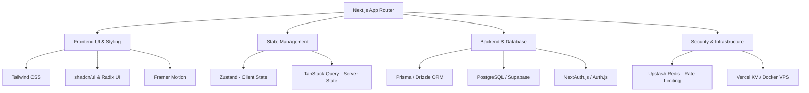

# Next.js & Full-Stack E-Commerce Project Guidelines

This document synthesizes the recommendations, best practices, architectural choices, and specific implementation rules extracted from the forwarded audio messages and chat screenshots.

---

## 1. Summary & Conclusion

### Overview of Core Recommendations
- **User Authentication Flow Strategy**: Implement a hybrid auth model. Use dedicated `/login` and `/signup` pages for primary authentication, deep links, and checkout flows. Use interactive login/signup **modals** exclusively for non-disruptive, in-context guest actions (such as adding items to cart or wishlist).
- **Architecture & Infrastructure Strategy**: Carefully evaluate **Serverless (e.g., Vercel)** versus **Dedicated VPS/EC2** hosting based on expected user volume and API request frequency to avoid per-request billing surprises.
- **Security & API Protection**: Enforce strict **API Rate Limiting** on all public and authenticated API routes to prevent DDoS attacks, bot scraping, and serverless bill spikes.
- **UI/UX & Visual Standards**: Avoid plain, generic UI default styles. Use cohesive color palettes, polished dark modes, micro-interactions, responsive design systems, and robust component libraries (Tailwind CSS, shadcn/ui, Framer Motion).
- **E-Commerce Operations**: Ensure optimistic UI updates for cart/wishlist actions, seamless guest-to-account cart merging, secure checkout redirects, and robust state management.

---

## 2. General Next.js & Full-Stack Rules

Core best practices and standards that must be incorporated into every Next.js full-stack project:

### Architecture & Performance Rules
1. **Server vs. Client Component Separation**:
   - Keep components as **Server Components (RSC)** by default for optimal bundle size, security, and fast initial page loads.
   - Use `"use client"` only when interactivity, local state (`useState`, `useEffect`), or browser APIs are explicitly required.
2. **Serverless vs. Dedicated VPS Hosting Choice**:
   - **Serverless (Vercel / AWS Lambda)**: Excellent for quick deployment, automatic scaling, and low initial traffic. However, monitor invocation costs closely as traffic grows, because per-request billing can scale rapidly.
   - **Dedicated VPS (Hetzner / DigitalOcean / AWS EC2)**: Recommended when API volume is consistently high and predictable. A fixed-cost VPS ($20–$50/month) eliminates per-request billing spikes.
3. **API Protection & Rate Limiting**:
   - Add rate limiting middleware (e.g., using `@upstash/ratelimit` or Redis) to all Next.js API routes and Server Actions.
   - Differentiate limits for guest users vs. authenticated users (e.g., 20 req/min for public endpoints, 100 req/min for authenticated users).
4. **SEO & Metadata**:
   - Define dynamic dynamic metadata (titles, meta descriptions, Open Graph, Twitter cards) on every page using Next.js `generateMetadata`.
   - Maintain clean HTML5 semantic hierarchy (single `<h1>` per page, proper `<main>`, `<nav>`, `<article>`, `<header>`, `<footer>` tags).
5. **Error Handling & Resiliency**:
   - Create custom `error.tsx`, `loading.tsx`, and `not-found.tsx` boundary files for seamless user experience during failures or background loading.

---

## 3. E-Commerce Specifics

Advice, UI flows, and feature rules tailored specifically for the E-Commerce platform:

### User Authentication & Interaction Flow Matrix
| Action / Trigger | Unauthenticated User Experience | Authenticated User Experience | Rationale |
| :--- | :--- | :--- | :--- |
| **Profile Button Click (Header)** | Redirect to dedicated `/login` page | Open User Profile / Dashboard | Standard auth navigation |
| **Add to Cart / Wishlist Action** | Show **Auth Modal** (non-disruptive) | Perform action immediately | Retains user context on product page |
| **Checkout Button Click** | Redirect to dedicated `/login?redirect=/checkout` page (No Modal) | Proceed to `/checkout` page | High-intent flow requires secure, dedicated space |
| **Direct Link / Marketing Ad** | Show full `/login` or `/signup` page (No Modal) | Direct access to landing page | Clean onboarding experience for ad traffic |

### Guest State Preservation
- When an unauthenticated user adds items to cart or wishlist, store their selection in `localStorage` or session cookies.
- Upon successful authentication (via Modal or Page), automatically merge the guest cart with their server database cart before redirecting.

### E-Commerce UI & Operations
- **Optimistic UI Updates**: Instantly reflect cart increment/decrement or wishlist toggles in the UI before waiting for the server response. Roll back smoothly if the network request fails.
- **Inventory & Stock Locking**: Verify item availability before rendering checkout. Implement temporary stock reservation timers during active checkout sessions.
- **Checkout Security**: Ensure all payment gateway handlers (Stripe, PayPal, Local Gateways) handle webhooks idempotently with signed signatures.

---

## 4. Technology Choices & Use Cases

Recommended stack and library choices for modern Next.js e-commerce development:

### Detailed Tech Stack Specifications
1. **Frontend Core & Framework**:
   - **Next.js (App Router)**: Hybrid SSR/SSG rendering, Server Actions for backend mutations, built-in image optimization (`next/image`).
2. **Styling & UI Components**:
   - **Tailwind CSS**: Utility-first styling with custom design tokens (`tailwind.config.js`).
   - **shadcn/ui + Radix UI**: Accessible, unstyled primitives customizable to achieve a premium UI.
   - **Framer Motion**: Smooth micro-animations for drawer modals, cart sidebars, and button hover states.
3. **State Management**:
   - **Zustand**: Lightweight client state for managing cart open/close states, local wishlist state, and active filters.
   - **TanStack Query (React Query)**: Efficient caching and revalidation for server-side data fetches.
4. **Database & ORM**:
   - **Prisma** or **Drizzle ORM**: Type-safe database queries.
   - **PostgreSQL (Supabase / Neon)**: Relational database for product catalogs, user accounts, orders, and payment records.
5. **Security & Rate Limiting**:
   - **Upstash Redis + `@upstash/ratelimit`**: Serverless rate limiting for API routes and auth endpoints.
